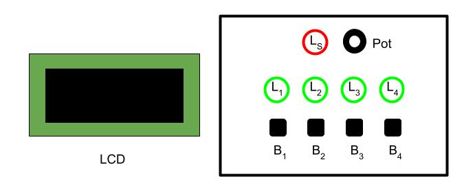

### Embedded Systems and IoT  - ISI LT - a.y. 2025/2026

## Assignment #01 - *Turn on the Sequence! (TOS)* 

v. 0.9.0-20251007
 
We want to realise an embedded system implementing a game called *Turn on the Sequence! (TOS)*. 

### Description 

The game board includes 4 green leds L1, L2, L3, L4 and red led LS, four tactile buttons B1, B2, B3, B4 and a potentiometer Pot, and an LCD. This is the suggested  layout:

During the game, the system repeatedly displays on the LCD a number of 4 distinct digits, each digit in the range between 1 and 4. Examples are: `1234`, `3421`, `4132`. Given the four digits, the player must turn on the leds in the order defined by the digits, from left to right, using the corresponding tactile buttons. Example: if the number displayed is `4132`, then the player must turn on the leds in the sequence L4, L1, L3, L2, by pressing in sequence the buttons B4, B1, B3, B2. Each button B[i] turns on the corresponding led L[i]. Each game involves multiple rounds. At each round, a new 4-digits number is chosen (at random) and displayed, and the player has a maximum amount of time T1 to turn on the sequence. If the player does it right, a score - starting from zero - is increased and the game goes on, with another round, but  reducing the time T1 of some factor F.  If the player does not turn the sequence on time or makes mistakes, the red led Ls is turned on for 2 seconds and the game ends, displaying the score on the LCD. 

**Game behaviour in detail**

In the initial state, all green leds should be off but led LS that pulses (fading in and out), waiting for some player to start the game. The LCD should display the message   “Welcome to TOS! Press B1 to Start” (on multiple lines).

If/when the button B1 is pressed the game starts.  If the B1 button is not pressed within 10 seconds, the system must go into deep sleeping. The system can be awoken back  by pressing B1 button. Once awoken, the system goes in the initial state and the led Ls starts pulsing again. 

When the game starts, all leds are turned off and a “Go!” message is displayed on the LCD. The score is set to zero.

During the game, at each round:
- The leds L1…L4 are turned off and a 4 digits number (with distinct digits, between 1 and 4) is displayed on the LCD.
- Then, the player has max T1 time for turning on the corresponding leds in sequence, by pressing the buttons B1…B4 (each button Bi turns on the corresponding led Li).
- If the player turns on the correct led sequence on time, then:
  - the score is increased and a message "GOOD! Score: XXX" (where XXX is the current score) is displayed on the LCD. 
  - The game goes on with another round, by reducing the time T1 of some factor F.  
- If the player either does not turn on the sequence on time or makes mistakes, then the red led Ls  is turned on for 2 seconds and the game ends. A message `Game Over - Final Score XXX` (where `XXX` is the final score) is displayed on the LCD (on multiple lines) for 10 seconds, then the game restarts from the initial state.

Before starting the game, the potentiometer Pot device can be used to set the difficulty L level  which could be a value in the range 1..4 (1 easiest, 4 most difficult). The level must affect the value of the factor F (so that the more difficult the game is, the greater the factor F must be). 

### The assignment

Develop the game on an MCU-based platform (e.g. Arduino), implementing the embedded software using the Wiring framework. Requirements:
- The game must be based on a super-loop control architecture.
- A procedural programming style should be adopted  (i.e. not object-oriented, that will be part of assignment #02) 
- you can choose concrete values for parameters (T1, F) in order to have the best game play. 

For any other aspect not specified, make the choice that you consider most appropriate.

The deliverable must a zipped folder `assignment-01.zip` including two subfolders:
- `src` 
  - including the Arduino project source code
- `doc` including:
  - a representation of the schema/breadboard using tools such as   TinkerCad or Fritzing or Eagle. 
  - a short video (or the link to a video on the cloud) demonstrating the system.

