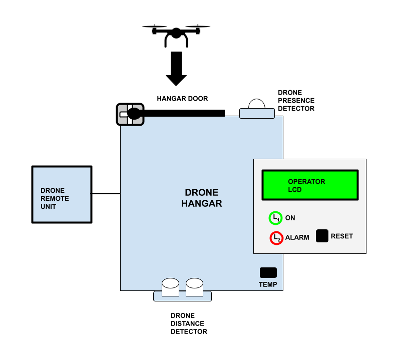

### Embedded Systems and IoT  - ISI LT - a.y. 2025/2026

## Assignment #02 - *Smart Drone Hangar* 

v1.0.0-20251112
 
We want to realise an embedded system called *Smart Drone Hangar*. The prototype  is meant to implement a simple smart hangar for a drone. 

### Description 

#### Components

The system is composed by two subsystems:

- **DRONE HANGAR** subsystem, based on Arduino 
  - **DRONE PRESENCE DETECTOR (DPD)** is a PIR, to detect the presence of a drone near (on top) of the hangar.
  - **DRONE DISTANCE DETECTOR (DDD)** is a sonar, to measure the distance of the drone when it is inside the hangar.
  - **HANGAR DOOR (HD)** is a servo-motor, controlling the hangar door.
  - **OPERATOR LCD** is a I2C LCD, used to interact with an operator.
  - **L1** is a green led, **L2** is a red led.
  - **RESET** is a tactile button.
  - **TEMP** is an analog temperature sensor.

- **DRONE REMOTE UNIT (DRU)**, program running on the PC
  - This GUI-based subsystem simulates a bridge to the drone, to send/receive commands. 
  - It communicates via **serial line** with the DRONE HANGAR subsystem.  

#### Description of the behaviour

At startup, the system begins with the hangar door **HD** closed, and it is assumed that the drone is inside, at rest. Indicator light **L1** is on, **L2** is off, and the **LCD** displays the message `DRONE INSIDE`. 

**Take-off phase**:
The drone activates the hangar door opening command by sending a message through the **DRU** subsystem. Upon receiving the command, the **HD** door opens, the **LCD** displays `TAKE OFF`, and the system waits for the drone to exit. To determine when the drone has left, the **DDD** is used: when the measured distance is greater than `D1` for more than `T1` seconds, it is assumed that the drone has exited, and the **HD** door is closed. The **LCD** then displays `DRONE OUT`. 

**Landing phase**:
When the drone approaches the hangar, it sends the opening command (via **DRU**). If, upon receiving the command, the **DPD** detects the presence of the drone, the **HD** door opens and the **LCD** displays `LANDING`. The system then waits for the drone to enter and land. When the distance measured by the **DDD** is less than `D2` for more than `T2` seconds, it is assumed that the drone has landed, and the door is closed. The **LCD** then displays `DRONE INSIDE`.

Whenever the drone is inside the hangar (whether at rest, during take-off, or during landing), the temperature monitoring system is active to check for potential problems. If a temperature ≥ `Temp1` is detected for more than `T3` seconds, the system enters a pre-alarm state. In this state, take-offs and landings are suspended, and the door remains closed. If a take-off or landing is already in progress, it is allowed to complete. If the temperature drops below `Temp1`, the system returns to normal operation. If a temperature `Temp2` > `Temp1` is detected for more than `T4` seconds, the **HD** door is closed (if it was open), the **L2** indicator light turns on, and the **LCD** displays `ALARM`. If the drone is outside the hangar, the `ALARM` message is also sent to the drone via **DRU**. All operations are suspended until the **RESET** button is pressed by an operator. When **RESET** is pressed, it is assumed that all issues have been resolved, and the system returns to the normal state.

The value of the `D1`,`D2`,`T1`,`T2`,`T3`,`T4`,`Temp1`,`Temp2` parameters is not fixed/specified (choose one).

The **DRU** subsystem is meant to have a GUI with controls to:
 - send command to the hangar, simulating behaviour of the drone (taking off and landing).
 - visualise:
   - the current state of the drone (rest, taking off, operating, landing);
   - the current state of the drone hangar (normal, alarm); 
   - (when landing) the current distance to ground.

### The assignment

Develop the embedded software on Arduino + PC connected through the serial line, implementing the Arduino part (**Drone Hangar**) in C++/Wiring e the PC part (**Drone Remote Unit**) in Java or in your favourite language.  **The Arduino program must be designed and implemented using task-based architectures and synchronous Finite State Machines**.

For any aspect not specified, you are free to choose the approach you consider more useful or valuable.

**The Deliverable**

The deliverable consists in a zipped folder `assignment-02.zip` including three directories:
- `drone-hangar`, including the source code of the Arduino-based subsystem
- `drone-remote-unit`, including the source code of the PC-based part
- `doc`, including:  a brief **report** describing the solution, in particular the diagram of the FSMs and the  representation of the schema/breadboard – using tools such as TinkerCad or Fritzing , and a **short video** (or the link to a video on the UNIBO OneDrive cloud) demonstrating the system.

